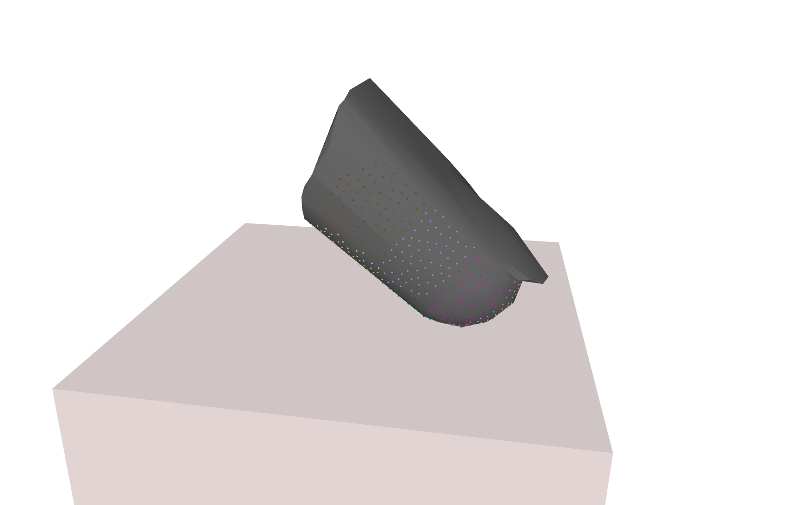

# Simulation of a Curved Tactile Sensor Array

* Author: David P. Leins <dleins@techfak.de>
* License: BSD 3-Clause License



## Prerequisites

- MuJoCo 2.3.6 or 2.3.7
- Drake (tested with 1.12.0 - 1.22.0)

## Installing and Running

1. Create catkin workspace (`mkdir -p mj_ros_demo_ws/src && cd mj_ros_demo_ws && catkin init`)
2. Clone the demo repository into the workspace with `git clone https://github.com/ubi-agni/mujoco_ros_demos src/mujoco_ros_demos`
3. Download ros package dependencies into catkin workspace src folder with `vcs import src < src/mujoco_ros_demos/hydroelastic_contacts/curved_fingertip/curved.deps`
4. Install MuJoCo and Drake by extracting the tar container and setting the following environment variables:
```
export MUJOCO_DIR=PATH_TO_EXTRACTED_MUJOCO_DIR
export DRAKE_DIR=PATH_TO_EXTRACTED_DRAKE_DIR

export LD_LIBRARY_PATH=$MUJOCO_DIR/lib:$DRAKE_DIR/lib:$LD_LIBRARY_PATH
export CPATH=$MUJOCO_DIR/include:$CPATH
export LIBRARY_PATH=$MUJOCO_HOME/lib:$LIBRARY_PATH

```
5. Build catkin workspace with `catkin b curved_sensor_demo` and source the devel workspace.
6. Run `roslaunch curved_sensor_demo curved_fingertip.launch use_sim_time:=true`.

sensor readings can be fetched on the `/baro` topic, e.g. in the terminal with `rostopic echo /baro`.

Run [demo.py](./scripts/demo.py) for automated movement of the fingertip and simultaneous plotting of the cell values. 

## Explanaition

This demo spawns a simulated fingertip with an array of 12 sensors on its surface.
The following section in the model file provides the config for the hydroelastic contact properties of geoms:
```xml
<custom>
    <!-- All custom parameters related to contact surfaces have the prefix cs:: -->
    <!-- Options are traingles or plygons, though currently only triangles are supported -->
    <text name="cs::HydroelasticContactRepresentation" data="kTriangle"/>
    <!-- If this option is enabled, the contact surface will be rendered in sim -->
    <numeric name="cs::VisualizeSurfaces" data="1"/>
    <!-- If cs::ApplyContactSurfaceForces is 0 Contact Surfaces are only computed for tactile sensors and standard mujoco contacts are used to compute physics -->
    <numeric name="cs::ApplyContactSurfaceForces" data="1"/>
    <!-- Contact properties for each geom: hydroelasticModulus, dissipation, resolutionHint.
    A rigid object has hydroelasticModulus of 0 and dissipation of 1. 
    A soft box with a resolution hint of 0 uses a resolution automatically computed by drake. -->
    <numeric name="cs::box_geom" data="0 1.0 0.01 0.3 0.3"/>
    <numeric name="cs::fingertip_geom" data="5e4 5.0 0 0.3 0.3"/>
</custom>

```


This next part defines a mocap body -- a body which is not affected by physics -- and attaches the body of the measure instrument to it with a weld constraint. This allows us to send target positions for the mocap body which controls the position of the measure.  
```xml
    <body name="mocap" mocap="true" pos="-0.02 0 0.07" euler="0 2.356194490192345 1.5707963267948966">
        <geom type="cylinder" size="0.01 0.018" rgba="1.0 0 0 0.001" contype="0" conaffinity="0" pos="-0.00003468 0.00118940 0.01668578" />
        <site name="mocap_site" type="box" size="0.25 0.25 0.25" rgba="1.0 0 0 0" group="0" /> 
    </body>

</worldbody>

<equality>
    <weld body1="mocap" body2="fingertip_body" active="true" />
</equality>

```

target positions can be sent with a ros service call to `/mujoco_server/set_mocap_state`, e.g. 
```bash
rosservice call /mujoco_server/set_mocap_state "mocap_state:
  name:
  - 'mocap'
  pose:
  - header:
      seq: 0
      stamp:
        secs: 0
        nsecs: 0
      frame_id: 'world'
    pose:
      position:
        x: 0.0
        y: 0.0
        z: 1.6
      orientation:
        x: 0.0
        y: 0.0
        z: 0.0
        w: 1.0"
```

In the simulation window, clicking `t` will toggle transparency of bodies, which makes inspection of the collisions easier. Pressing `w` toggles wireframe mode, making the rendered contact surface better visible.